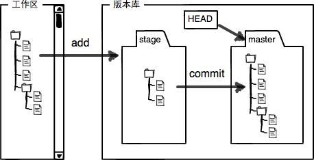

# 完全使用Git命令行进行版本管理工作

##目录

## 一、版本控制（管理）概述

&nbsp;&nbsp;&nbsp;&nbsp;简单地来说，版本控制/管理就是文件变更历史记录保存工具，通过版本控制，我们可以很方便地追溯一个文件经历过哪些变更，与现在对比有什么样的不同等。   

&nbsp;&nbsp;&nbsp;&nbsp;最原始的版本控制，是通过复制一个文件或文件夹的形式实现，如文件夹1.0、文件夹2.0，这种原始的管理方式对于单个文件来说，可以勉强接受，但如果是大量的源码文件 ，多人合作的文件时，简直就是一场灾难。合并文件复杂，对比复杂，查找历史记录复杂，所有的操作都是费时费力，且非常容易出错。 所以针对这种痛点，人们发明版本控制的软件，来解决文件版本管理的问题。  
  
&nbsp;&nbsp;&nbsp;&nbsp;最早的版本控制软件是哪一个，其实无需去追寻，但早期最流行的版本控制软件是CVS无疑，后来便进化为大名SVN,目前还有多的公司在使用，CVS及SVN是使用C/S集中式架构的版本管理控制工具，文件所有的变更都保存在Server端，以Server为中心客户端可能通过网络连接的形式从服务端提取出文件，保存在本地，但本次只能提取某一个版本/或分支的文件，不可查看历史记录，历史记录其实是查看服务端的文件变更记录。客户端有变更时，将变更保存起来并提交到服务端。

&nbsp;&nbsp;&nbsp;&nbsp;这种结构的版本依赖于网络及服务端，当服务端有问题或网络不通时，将不能进行工作。特别是由于所有的历史记录都保存在服务端，一旦服务端挂了，整个版本库都没有了。

&nbsp;&nbsp;&nbsp;&nbsp;正是因为Svn存在这么多的问题，所以Linux的创始人Linus Torvalds一直没有使用SVN来进行Linux的，而是采用了一种分布式的代码版本控制工具BitKeeper来进行Linux内核代码的版本管理，由于BitKeeper是商业版的，所以后来Linus花了两周的时间写了另外一个开源的版本软件Git并在一个月之内将Linux内核代码托管到Git上了，这就是牛人! 于是Git迅速成为最流行的分布式版本控制系统，时至今天几乎所有的公司都在使用Git进行代码托管，除了因为历史遗留的原因而使用SVN之外。

## 二、Git概述
&nbsp;&nbsp;&nbsp;&nbsp;通过上文的介绍可以知道Git是一款免费、开源的分布式版本控制系统。相对于Svn那种集中式版本控制系统，Git没有客户端与服务端的区分，每台电脑都上的版本库都是一个独立的仓库，即每个版本库都可以在离线的情况下完成版本管理所有操作。

### 2.1 Git仓库构成
如下图所示， Git中每个仓库分为两大区域：

* 第一个是工作区，它持有实际文件, ；
* 第二个是 缓存区（Index），它像个缓存区域，临时保存你的改动；
* 最后是 HEAD，指向最近一次提交后的结果； 
* 当然还有一个区域就是版本数据库，它保存了版本库中所有文件数据。

### 2.2 GIT仓库间说明
### GIT代码托管平台

## 三、Git安装与使用
### Windows下Git安装
* 
* Git客户端管理工具安装：下载最新版本的TortoiseGit，按步骤安装即可。
* Git仓库及Git客户端，安装最新版即可
### Linux下Git安装
建议直接通过包管理器进行安装，如CentOS直接使用 yum install git 进行安装，Ubuntu
Mac下Git安装

## 为什么要使用命令行，而不是客户端进行Git管理
## Git参数配置

用以标识身份，如提交人等: 

  git config —global user.name “yangxg”   
  git config —global user.email “yangxg@51good.cn”  
  git config –list  看下参数配置是否有效
##GIT基本操作  
##分支管理
master 保持与主干仓库代码一致，不能作为开发分支使用，每次开发新需求时，需基于最新的主干代码新建分支进行开发。

## GIT日常工作流程
仓库建立或初始化  
	git init 在需要初始化的目录执行
	git clone 远端仓库地址如：https://github.com/guoho/git-commend-doc.git
git add  添加新文件 新文件加入版本库
git commit  提交新文件
 
2.	日常工作流程
 Git add 
 Git commit 
 Git log 
 Git diff

新需求开发日常工作流程（每次新需求开发都要进行的工作流程）：

研发人员在基于master新建develope分支进行开发；
开发完成后，自测通过，合并代码至251测试环境由测试进行测试；
修复测试中遇到的各种问题，完成测试环节；
合并代码至84测试环境由产品人员进行验收；
验收通过，完成需求验收环节；
合并代码至master分支并git push 推送代码至 git.91160.com 个人账号仓库下;
研发人员在 git.91160.com 个人账号仓库发起 request merge 请求至 root 项目；
通知研发主管对审核合并申请，并合并代码；
研发主管给”root/代码项目”打标签（打版）；
将版本发送给运维人员，由运维人员对代码进行部署或编译。
